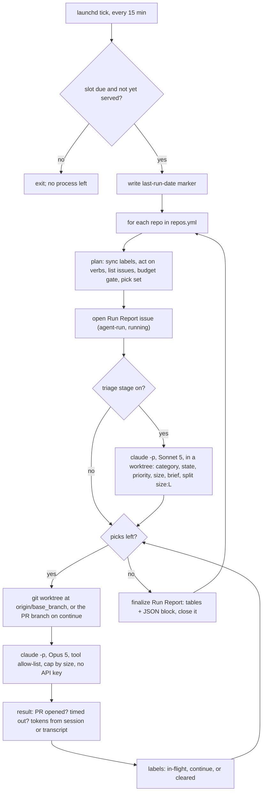
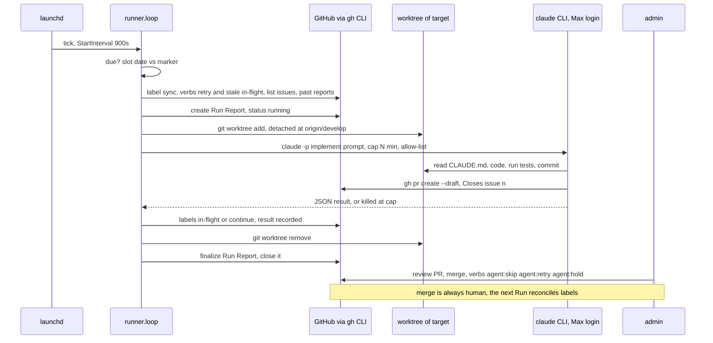

# issue-runner architecture

Living document. Update it when the flow changes; the ADRs in `docs/adr/` hold the reasons,
`CONTEXT.md` holds the vocabulary, `README.md` holds the how-to.

## The two repos

| | `issue-runner` | a target repo (today: `wp-content-agent`) |
|---|---|---|
| Role | the operator: scheduler, pick logic, prompts, labels, reports | the workload: issues to triage and fix, code to change |
| Knows about the other? | yes: `repos.yml` lists each target's local checkout path and config | **no**: zero references to issue-runner in its code or CI |
| What crosses the boundary | GitHub labels, issues, PRs, comments on the target; a git worktree of the target's `base_branch` | its `CLAUDE.md`, `.claude/agents`, `.claude/skills`, tests and lint, which every session obeys |
| Lives | one public repo, cloned on the admin's Mac | wherever it already is |

The contract is GitHub state (see ADR 0001). issue-runner never imports target code and the target never
imports runner code. Adding a second target is one more entry in `repos.yml`.

## What issue-runner is, physically

**Not a server.** Nothing listens on a port, nothing stays resident. It is a Python CLI (`runner.loop`)
that launchd starts every 15 minutes as a user agent (`~/Library/LaunchAgents/com.maneran.issue-runner.plist`).
Each tick the process lives for under a second unless the day's slot is due, in which case it runs the
Run (minutes to hours) and exits. Between ticks there is no process.

Requirements for a tick to happen: the Mac is awake and the admin is logged in (launchd `gui` domain).
A slot missed while asleep is served by the first tick after wake, even past midnight.

## Flow of one Run

## Who talks to whom

## State, and where it lives

| State | Where | Owner |
|---|---|---|
| Which issues are eligible, in flight, continuing, skipped | labels on the target's issues | runner labels: the runner; verb labels: the admin; triage labels: the agent, admin overrides |
| History of every Run (picks, skips, PRs, minutes, tokens) | one `agent-run` issue per Run on the target, JSON block at the bottom | runner |
| Per-issue trail | comments on the issue (AI disclaimer first line) and the PR body | agent |
| Schedule, stages, quota, caps, budget, models, tool allow-list | `issue-runner/repos.yml` (gitignored, per machine) | admin |
| Last slot served | `~/.issue-runner/last-run-date` | runner |
| Full session output, tokens | `~/Library/Logs/issue-runner/<stamp>/` | runner |
| Canonical labels | `issue-runner/labels.yml` | runner repo |
| Prompts | `issue-runner/prompts/*.md` | runner repo |

No database, no server, no second copy of anything on GitHub.

## Boundaries the code enforces

- Sessions never run in the admin's checkout: always a throwaway worktree under `~/.issue-runner/worktrees`.
- Sessions never see `ANTHROPIC_API_KEY` or `ANTHROPIC_AUTH_TOKEN`; local mode refuses to start if one is exported.
- Tool access is an allow-list; a call outside it fails instead of prompting.
- A session is killed at its cap; the prompt states the cap and asks for a draft PR before it.
- The agent never merges, never force-pushes, never touches another issue.
- Run Reports and per-issue results are the only place the runner writes history; nothing is swept.
- Picks run one at a time; a failing pick is recorded as `failed` and the next pick still runs; the
  Run Report is always finalized.
- When an agent PR is merged, the next Run closes its issue (GitHub only does this on the default branch).

## Known limits and next steps

- Free-text follow-ups on a PR are not wired locally (`@claude` needs a GitHub-side trigger). A future
  verb `agent:revise` could make the next Run act on review comments.
- The budget gate is checked once per Run, not per pick: with quota 3 and half an hour left, all
  three sessions run. Overshoot is bounded by one Run.
- Dashboard (static page on GitHub Pages reading the GitHub API with a PAT) is designed, not built.
- Triage stage is written and wired but has not run on a real repo yet.
- One target so far; multi-repo is a `repos.yml` change.
